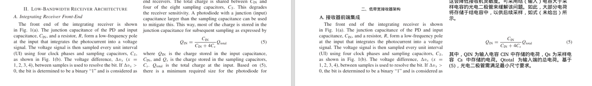
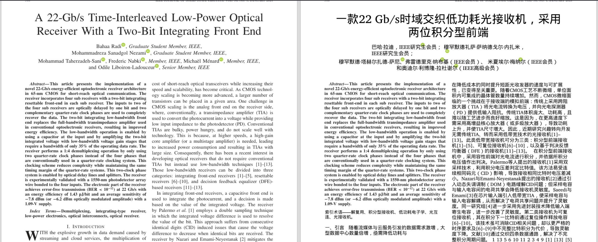

# V2 问题：部分段落始终未翻译，漏块并提示 QA 告警

## 问题描述

有些地方始终是没有翻译，漏一块，然后提示 存在 QA 告警

## 根因分析

经代码审查，确认有 **4 个根本原因** 导致可翻译文本块被错误保留原文：

### 原因 1：重叠阈值过低（绝对值 0.5 sq pt），导致大量误判

`pdf_composer.py` 中保护区重叠判断使用 `(rect & r).get_area() > .5`，即 0.5 平方点的绝对阈值。
一个 300×20pt 的文本块面积 6000 sq pt，边缘哪怕 0.1% 的微小重叠（6 sq pt）就触发保留。
PDF 解析中 bbox 边缘微小重叠极其常见，此阈值导致大量本可翻译的段落被误判为"与公式或图形保护区相交"。

**修复**：引入 `_significant_overlap()` 函数，使用 **绝对底限（5 sq pt）+ 相对阈值（10%/15%×较小块面积）** 双重判定，
消除 bbox 边缘微小重叠的误判。

### 原因 2：级联保留 — 一个块保留后拖垮相邻块

当块 A 因重叠被保留后，其 rect 被加入 `protected` 列表，导致相邻的块 B 也因与块 A 重叠而保留，块 B 又影响块 C……
形成级联效应，一整片区域全部跳过翻译。

**修复**：相对阈值天然抑制级联 — 微小重叠不再触发保留，大幅减少级联发生。

### 原因 3：级联保留（根因）— 二次检查误杀

初始保留逻辑将保留块的 rect 加入 `protected` 列表，二次检查时用此列表判断
已排版块是否与"保护区"相交。但保留块的原文和相邻译文块的 line_rects 分属
不同 PDF 文本行，涂黑不会互相影响。二次检查应只判断 **真正的保护区**
（公式/图形/图片），而非保留文本块，否则产生级联。

**修复**：分离 `protected_artwork`（公式/图形/图片）和 `protected`（含保留块），
二次检查仅对 `protected_artwork` 判定，彻底消除级联。

### 原因 4：已排版块互相重叠时双方都被丢弃

两个已成功排版的块，哪怕只有极小的 bbox 边缘重叠（PDF 解析中极常见），两个翻译都会被丢弃。

**修复**：改为只丢弃较小的块（通常是碎片），保留较大的块。

## 附加修复

### 修复 4：动态字号与版式挤压算法（Dynamic Scaling & Compression）

中文译文通常比英文原文长，"超出原区域"条件触发时直接保留原文过于粗暴。
实现了系统化的多级挤压机制，在可读性和空间适配之间自动寻优：

| 级别 | 字号缩放 | 行高 | 说明 |
|------|---------|------|------|
| 1 | 100% | 1.15 | 原始排版，最佳可读性 |
| 2 | 100% | 1.10 | 仅压缩行高，视觉差异极小 |
| 3 | 95% | 1.10 | −5% 字号 + 紧凑行高 |
| 4 | 95% | 1.05 | −5% 字号 + 紧行高 |
| 5 | 90% | 1.05 | −10% 字号 + 紧行高 |
| 6 | 90% | 1.00 | −10% 字号 + 最小行高 |
| 7 | 85% | 1.00 | −15% 字号 + 最小行高（最后手段） |

- 算法按级别顺序尝试，**接受第一个能容纳全部译文的组合**
- 同时配合 PyMuPDF 的 `scale_low` 参数，允许引擎内部进一步微调
- 仅当 7 级全部无法容纳时，才保留原文

### 修复 5：解析器 inside_art 检测误判

`pdf_parser.py` 中 `inside_art` 检测使用 `r.contains(rect)`，但 `cluster_drawings()`
有时生成超大 bbox，意外包含距实际图形很远的文本块。
增加面积比限制：绘制区域面积不得超过文本块面积的 8 倍。

### 修复 6：math_chars 启发式阈值过松

原条件 `len(text) < 160 and math_chars / len(text) > 0.12` 过于激进，
含少量希腊字母（α, β）的短段会被误判为公式。
收紧为 `len(text) < 80 and math_chars / len(text) > 0.30`，
仅对极短且数学字符占比极高的情况才标记为公式。

## 修改文件

| 文件 | 修改内容 |
|------|----------|
| `backend/app/services/pdf_composer.py` | 新增 `_significant_overlap()` 相对阈值函数；初始/二次保护区检查改用相对阈值；**分离 `protected_artwork`/`protected` 消除级联保留**；已排版块重叠只丢较小块；**动态字号与版式挤压算法**（7 级字号×行高渐进压缩） |
| `backend/app/agents/orchestrator.py` | **3 线程并发翻译**：`asyncio.Semaphore(3)` + `asyncio.gather` 替代逐块串行翻译 |
| `backend/app/services/pdf_parser.py` | `inside_art` 增加面积比限制；`math_chars` 条件收紧阈值 |
